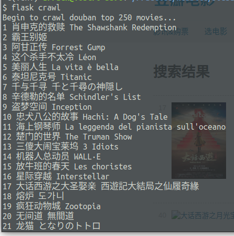

# Douban

### 简介
#### 0. 说明

本来是想发布在 `pythonanywhere.com`，但豆瓣不在该网站的 API 白名单内，因此无法使用爬虫，所以搁浅。截图为本机 localhost。

#### 1. 爬取

爬虫为 requests + BeautifulSoup，每爬取 25 条信息保存一次数据库



#### 2. 首页

数据库保存的是原网站图片链接，由于访问次数过多，导致部分图片无法显示。


#### 3. 详情页


#### 4. 搜索

搜索建议是使用 pytrie 在启动应用时查询一次数据库返回所有条目，建立前缀搜索树常驻内存。


#### 5. 点击搜索建议

点击搜索建议，默认搜索条件为搜索建议，会跳转至搜索结果页，仅一条结果。

其实这里直接跳到详情页而减少一次查询比较好，由于我前端比较弱，url_for + jquery 纠结的不行，就还是执行了查询。


#### 6. 点击搜索

执行查询。


### 配置
Python 3.6+
#### 依赖
`requirements.txt` 可使用以下命令安装依赖
```
$ pip install -r requirements.txt
```

#### 安全
`instance/secure.py`, _需自行创建并配置以下变量_

- SECRET_KEY
- SQLALCHEMY_DATABASE_URI
- SQLALCHEMY_TRACK_MODIFICATIONS

#### 环境(可选)
`.env`, _需自行创建并配置以下变量_

- FLASK_ENV

#### 应用
`app/config.py`, _已创建，可自行调整_
- MOVIES_PER_PAGE

### 使用
1. 克隆项目
2. 安装依赖，配置文件
3. 连接数据库
4. 在服务器后台输入以下命令初始化数据表
```
flask initdb
```
5. 在服务器后台输入以下命令从豆瓣自动爬取数据并存入数据库
```
flask crawl
```
6. 启动网站服务
